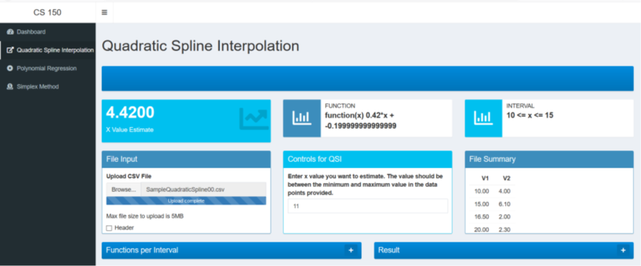
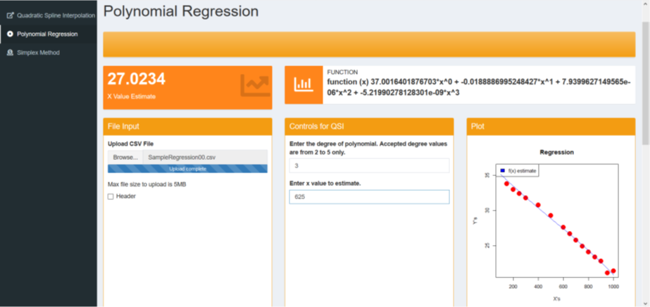
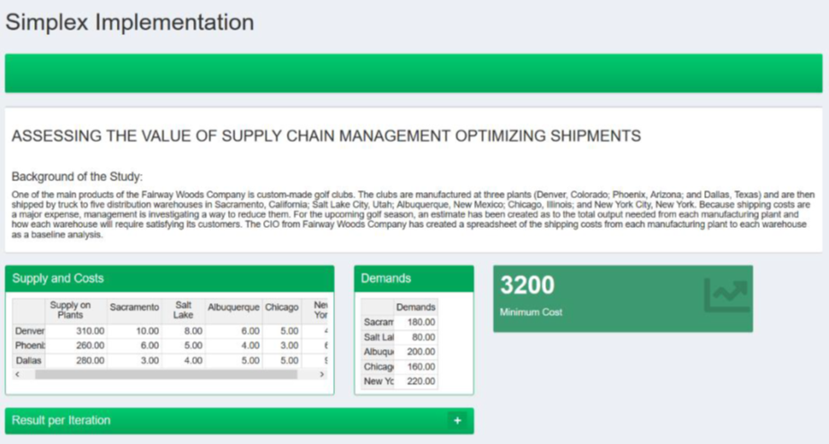

# Optimizers and Generic Solvers
Solvers using quadratic spline interpolation, polynomial regression, simplex, and optimization

## So What?
### CURVE FITTING
&nbsp;&nbsp;&nbsp;&nbsp;&nbsp;&nbsp; Information is often provided along a spectrum of distinct values. You may need comparisons between the distinct values, though. This program uses techniques for obtaining intermediate estimates to match curves to such details. You may also need a simplified version of a complex function. Another approach to do this is to measure feature values along the spectrum of interest at a set of distinct values. Then, to fit these values, a simpler function can be derived. Both of these applications are referred to as curve fitting.   
&nbsp;&nbsp;&nbsp;&nbsp;&nbsp;&nbsp; There are two general curve fitting methods that are distinct from each other based on the amount of error associated with these results. First, if these data show a significant degree of error or noise, the strategy is to derive a single curve representing the general trend of these data. Since any single data point may be inaccurate, we do not make any effort to converge that value. Alternatively, the curve is structured to follow the pattern taken as a group of points. One method of this kind is called least-squares regression.   
&nbsp;&nbsp;&nbsp;&nbsp;&nbsp;&nbsp; Second, where it is known that these data are very accurate, the basic approach is to fit a curve or a series of curves that pass directly through each point. Usually these data come from tables. Interpolation is the estimation of values between well-known discrete points. [1]  

### OPTIMIZATION
Optimization involves either the minimum or the maximum being searched. The optimum is where the curve is flat. The simplex method for solving linear programming problems was discovered by Koopman's student Dantzig in 1947. A number of researchers, especially Charnes and his colleagues, paved the way for other forms of constrained optimization. [1]  

## First Things First
### Libraries needed
To install the package, you just need the name of the package and use the command `install.packages("package")`
* shiny
* shinyWidgets
* shinydashboard
* shinydashboardPlus
* rhandsontable

### Functions for solving
To import other functions that are to be used in solving, use the `source()` function, at the top of your script in the same way that you call an R package. R will then load those functions into memory and you can use them. Some needed functions:
* “QSI.R”
* “Regression.R”
* “SimplexV2.R”

## 1. Quadratic Spline Interpolation
A generic solver that accepts a .csv file and generates an output of the sought function and the x-estimate

#### FUNCTIONALITIES
1. **File Upload** – click the “Browse” button and choose the file that you want to input (must be a .csv file).
2. **Value** – you may enter your desired x value to estimate from the function (an empty text box would return null)

#### OUTPUT:
3. **File Summary** – the data points which the file contains
4. **Functions per Interval** – for QSI; shows the functions produced with respect to their interval
5. **Result** – shows the augmented coefficient matrix per iteration

## 2. Polynomial Regression
A generic solver that accepts a .csv file and generates the functions for every interval. It also gives the correct function for the x-estimate, and the x value as well.

#### FUNCTIONALITIES
6. **Degree** – the degree of the polynomial (values accepted are from 2 to 5 only)

#### OUTPUT:
7. **Estimate** – the result of substitution of the input x value to the function
8. **Function** – generated function using the method and the .csv file which contains the data points

## 3. Simplex Method
Uses dual simplex method for minimization problems. A table is provided to easily modify the values and find the minimum cost.

#### FUNCTIONALITIES
9. **Table** – original values are already inputted in the table. You can modify the values by just clicking the cell and typing the new value. The supply and costs are included on the first table, while the demands per warehouses are on the second.

#### OUTPUT:
10. **Minimum Cost** – cost obtained using simplex (dual simplex) method
11. **Result per Iteration**

REFERENCE:
*[1] Chapra, Steven C. Numerical methods for engineers / Steven C. Chapra, Berger chair in computing and engineering, Tufts University, Raymond P. Canale, professor emeritus of civil engineering, University of Michigan. — Seventh edition.*
